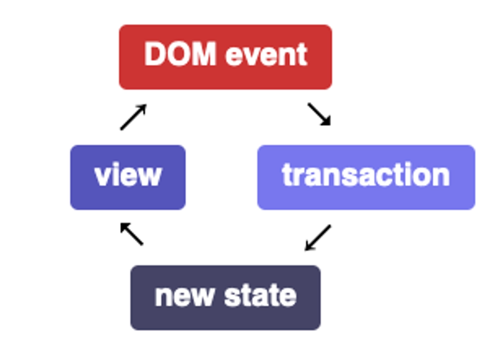

# codemirror6使用

codemirror6变化较大，跟版本5相比，完全就是两个东西了，新版拆分比较细，可以按需引入用到的包。

### 模块
codemirror6值的操作主要是对state的操作，数据流的互动如下图所示，即该视图聆听事件。当DOM事件进来时，它（或绑定到密钥的命令或按扩展名注册的事件处理程序）将其转换为状态交易并分配它们。这建立了一个新状态。当将新状态授予视图时，它将自行更新。

##### 状态`EditorState`
文本信息放到了`EditorState`这个类
``` javascript
import { EditorState, type Extension, Compartment, StateEffect } from "@codemirror/state"
import { javascript } from "@codemirror/lang-javascript"
import { java } from "@codemirror/lang-java"

let state = EditorState.create({
    doc: doc, // 文本
    extensions: codemirrorPlugin // 插件数据
})
```
##### 视图`EditorView`
`codemirror6`中文本信息的展示使用的是`EditorView`

``` javascript
let view = new EditorView({
    state: state,
    parent: element
})
```
##### 隔箱`Compartment`
 - 隔箱是一个特殊的插件类，用于封闭真正的插件，当插件传入`EditorState`后，是无法直接动态改变里面的插件的，如果要改变里面的插件，就要用到Compartment封闭插件。
 - 使用场景：用户需要根据选择的语言，动态更改语法高亮

 ``` javascript
 let languageCompartment = new Compartment()
 // inject,向编辑器注入插件（也可以在EditorState创建时传入）
 view.dispatch({
    effects: StateEffect.appendConfig.of(languageCompartment.of(javascript()))
 })
 // reconfigure,向编辑器修改某个插件
 view.dispatch({
    effects: languageCompartment.reconfigure(java())
 })
 ```
 ##### 语法高亮
 分静态高亮及动态高亮，下面看动态高亮
 隔箱更新函数
 ``` javascript
export function createEditorCompartment(Compartment, StateEffect) {
  const compartment = new Compartment();
  const applyExtension = (view, extension) => {
    const existCompartment = compartment.get(view.state);
    if (existCompartment) {
      view.dispatch({
        effects: compartment.reconfigure(extension)
      });
    } else {
      view.dispatch({
        effects: StateEffect.appendConfig.of(compartment.of(extension))
      });
    }
  };
  return {
    compartment,
    applyExtension
  };
}
 ```

 ``` javascript
 import { Compartment, EditorState, StateEffect } from '@codemirror/state';
 import { LanguageDescription } from '@codemirror/language';
import { languages } from '@codemirror/language-data';

let { languageCompartment, applyExtension: applyLanguage } = createEditorCompartment(Compartment, StateEffect);


function updateLanguage(type) {
      if (fileExt) {
        const languageDescription = LanguageDescription.matchLanguageName(languages, type, true);
        languageDescription.load().then(support => {
          applyLanguage(this.view, support);
        });
      }
    }
 ```